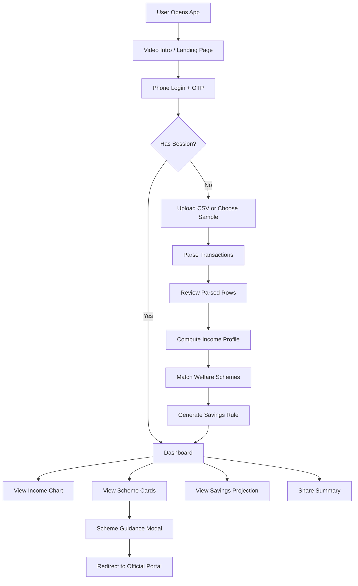
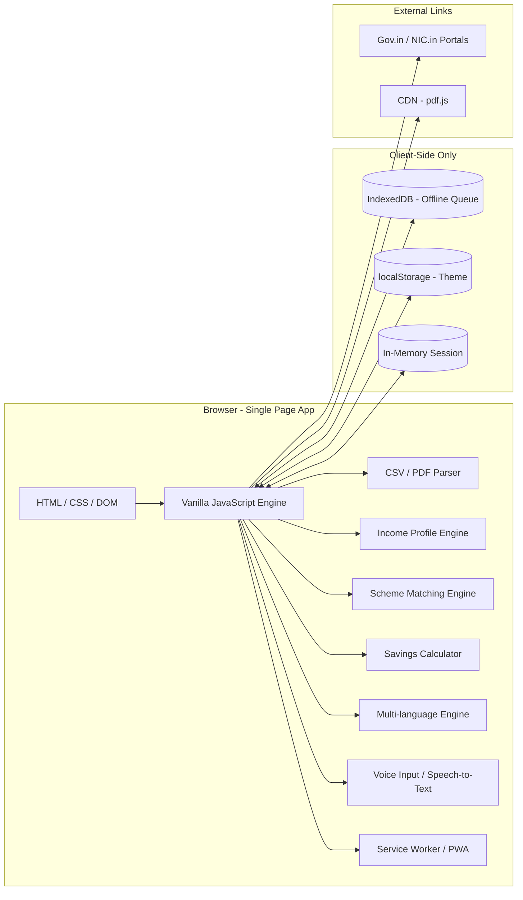

<div align="center">

# 💳 Kaam Card

**A privacy-first, browser-based platform that turns raw transaction data into welfare eligibility — in under 2 minutes.**

Built for India's 400M+ informal and gig workers, without ever asking for Aadhaar, PAN, or a server upload.

[](#technologies-used)
[](#features)
[](#privacy-and-safety)
[](#license)

[How It Works](#-how-it-works) • [Features](#-features) • [Demo Flow](#-demo-flow) • [Run Locally](#-run-locally) • [Privacy](#-privacy-and-safety)

</div>

---

## 📖 Overview

Kaam Card transforms raw transaction data (CSV/PDF bank or UPI statements) into a **portable income profile**, matches workers against public welfare schemes using transparent eligibility rules, and suggests personalized micro-savings habits — all within 2 minutes, without storing any raw data or requiring Aadhaar/PAN.

The goal is to bridge the gap between India's informal workforce and the social security schemes they qualify for, by making their income story easy to understand, explain, and act on.

---

## 🔄 How It Works

1. **Secure Session** — Enter a phone number and demo OTP to start an isolated, in-memory sandbox session.
2. **Data Upload** — Upload a bank statement CSV/PDF or pick a sample dataset. Parsed entirely in-browser with malformed-row tolerance.
3. **Income Profile** — From credit transactions, computes: avg daily income, variance (σ), good/bad day thresholds (mean ± 0.5σ), counts, and monthly estimate.
4. **Scheme Matching** — Income profile + age + occupation + state matched against 27 welfare schemes via deterministic scoring.
5. **Savings Rule** — Arithmetic micro-savings: on high-earning days, set aside surplus to cover low-income days.
6. **Dashboard** — Income chart, ranked scheme cards, savings projection, and shareable summary.

---

## ✨ Features

### 📊 Income Analysis
- CSV/PDF bank/UPI statement parsing — supports generic, GPay, PhonePe, Paytm formats
- 3 sample datasets: Delivery worker, Street vendor, Messy CSV
- Malformed-row tolerance with per-row error reporting
- Daily earnings trend bar chart (good/bad/neutral color-coded)
- Expense auto-categorization (Food, Transport, Bills, Groceries, Healthcare, etc.)
- Expense summary with top-category detection

### 🏛️ Scheme Matching
- 27 welfare schemes: PM-SYM, e-Shram, PM-JAY, PM-SVANidhi, PMJJBY, PMSBY, Atal Pension Yojana, PM MUDRA, PMKVY, Stand-Up India, ABHA, Janani Suraksha, Matru Vandana, Ekta Mall, NPS Vatsalya, and 10 state-specific BOCW boards
- Deterministic rule engine using age, income, occupation, and state
- Ranked results with eligibility / near-match classification
- Plain-language reasons for each match
- Step-by-step application guidance modal with document checklist per scheme
- Scheme search & filter
- `.gov.in` / `.nic.in` domain-validated portal redirects
- Deadline tracking with reminders

### 💰 Smart Savings
- Personalized good-day surplus calculation (45% of income above threshold)
- Projected monthly, 3-month, and 6-month savings estimates
- Low-income day coverage projection

### ♿ Accessibility
- High-contrast mode
- Voice input (speech-to-text) — supports Hindi, Tamil, Telugu, Marathi, English
- Screen reader live announcements (`aria-live`)
- Skip-to-content navigation link
- Keyboard & focus management

### 🔒 Privacy & Security
- 100% in-browser — zero data sent to any server
- No Aadhaar, PAN, or bank account numbers collected
- Raw transaction rows discarded after aggregate computation
- In-memory session with phone-keyed isolation
- No `localStorage` for session data (only theme preference)
- Session timeout (30 min idle) with auto-purge
- Local Security Audit Trail logging all user actions
- Verified portal links validated against `.gov.in` / `.nic.in`
- Consent flow before data parsing
- Links inside uploaded files treated as inert text

### 🌐 i18n & UX
- Multi-language: English, Hindi, Tamil, Telugu, Marathi
- Light/dark theme with system preference detection
- Mobile-first responsive design with adaptive layouts
- Animated particle grid background
- Slide-out side rail menu + right sidebar
- Bottom navigation (Dashboard, Upload, Insights, Schemes)
- Shareable plain-text worker profile summary

### 📦 PWA & Offline
- Service Worker with cache-first / network-first strategies
- Installable via PWA manifest
- Offline support for cached assets
- Offline upload queue via IndexedDB (localStorage fallback)
- Background sync for pending uploads
- Push notification handling

### 🧪 Testing
- 30+ unit tests: CSV parsing, profile computation, expense profiling, translations, formatting, occupation normalization, loan eligibility

### 🐳 Infrastructure
- Dockerized (nginx:alpine with gzip, caching, envsubst)
- Python scheme scraper utility

---

## 🗺️ Process Flow Diagram



---

## 🏗️ Architecture Diagram



---

## 🛠️ Technologies Used

### Core Stack

| Technology | Usage |
|---|---|
| **HTML5** | Application shell and semantic structure |
| **CSS3** | Responsive layout, theming (custom properties), animations |
| **Vanilla JavaScript (ES6+)** | All application logic — no framework dependencies |
| **IndexedDB** | Offline upload queue |
| **Service Workers** | Offline caching, PWA installability |
| **PDF.js** | Client-side PDF statement parsing |
| **Web Speech API** | Voice input (speech-to-text) in 5 languages |

### Planned / Architecture Vision

| Service | Purpose |
|---|---|
| **Google Cloud Translate API** | Real-time translation for additional Indian languages |
| **Google Maps Platform** | Worker location detection for state-specific matching |
| **Firebase Authentication** | Production-grade phone OTP auth replacing demo flow |
| **Firebase Analytics** | Usage metrics to improve scheme coverage |
| **Google Cloud CDN** | Low-latency PWA asset delivery |
| **NVIDIA RAPIDS** | GPU-accelerated income variance & anomaly detection |
| **NVIDIA NeMo** | NLP for extracting criteria from government PDFs |
| **NVIDIA Triton Inference Server** | ML-based scheme recommendation deployment |
| **NVIDIA cuDF** | High-volume CSV/DataFrame processing |

---

## 🎬 Demo Flow

1. Open the app — intro video plays, transitions to landing page.
2. Tap **LOG IN / START**, enter a phone number and any 4-digit OTP.
3. Upload a CSV/PDF statement or choose a sample dataset.
4. Review parsed rows and any skipped malformed rows.
5. Dashboard loads with income pattern, matched schemes, and savings rule.
6. Use bottom navigation for **Dashboard**, **Upload**, **Insights**, **Schemes**.
7. Tap any scheme card for step-by-step application guidance.
8. Copy the shareable summary from the **More** menu.

---

## 🚀 Run Locally

Static HTML/CSS/JS app — no build step required.

```bash
python3 -m http.server 8080
```

Then visit `http://localhost:8080`.

### Docker

```bash
docker build -t kaam-card .
docker run -p 8080:8080 kaam-card
```

---

## 📄 CSV Format

```csv
date,amount,direction
2026-05-01,720,credit
2026-05-02,210,debit
```

| Field | Details |
|---|---|
| **Date formats** | `YYYY-MM-DD`, `DD-MM-YYYY`, `DD/MM/YYYY` |
| **Income directions** | `credit`, `income`, `in`, `deposit`, `received`, `cr` |
| **Debit directions** | `debit`, `expense`, `withdrawal`, `paid`, `dr` |

> Debit/expense rows are parsed but not counted as income.  
> GPay, PhonePe, and Paytm CSV formats are auto-detected.

---

## 🔐 Privacy and Safety

- No Aadhaar, PAN, or full bank account numbers collected.
- Uploaded transactions processed entirely in the browser.
- Raw transaction rows discarded after aggregate income stats computed.
- Demo session is in-memory and phone-keyed — no password.
- No session token in `localStorage` (only theme preference persisted).
- External scheme links are hardcoded HTTPS URLs validated against `.gov.in` / `.nic.in`.
- Links found inside uploaded files treated as inert text — never auto-followed.

---

## 📁 Project Structure

```
.
├── index.html              # Entry point
├── styles.css              # All styles
├── app.js                  # Application logic + i18n (5 langs)
├── api.js                  # Simulated localStorage-backed API
├── db.js                   # IndexedDB wrapper
├── csv-parsers.js          # CSV transaction parser
├── pdf-parser.js           # PDF.js integration
├── translate.js            # i18n auto-translation tool (Node)
├── tests.js                # Automated test suite
├── sw.js                   # Service Worker
├── manifest.json           # PWA manifest
├── schemes_db.json         # Welfare scheme database
├── debug.js                # Debug utility
├── land.mp4                # Intro video
├── favicon.svg / logo.svg / m.svg
├── COMPONENTS/UI/          # Design reference components
├── scripts/                # Scheme scraper utility
├── Dockerfile              # Nginx container
├── nginx.conf.template     # Nginx config
├── start.sh                # Container entrypoint
└── .github/                # CI/CD workflows
```

---

## ✅ Hackathon Definition of Done

A worker can go from sample/uploaded statement to:

- ✅ income pattern visualization
- ✅ matched schemes with plain-language reasons
- ✅ a concrete, personalized savings suggestion
- ✅ a shareable summary

**without** exposing sensitive identity numbers or persisting raw transaction data.

---

<div align="center">

Made with ❤️ for India's informal workforce

</div>