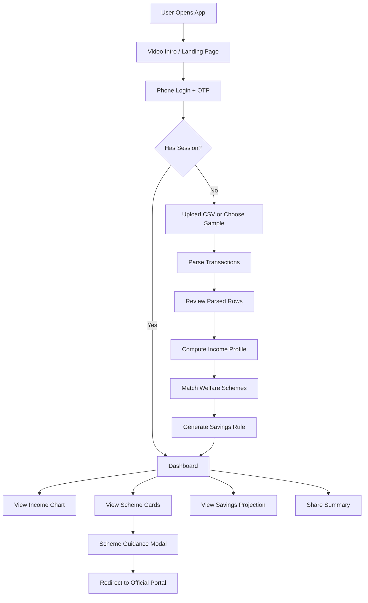
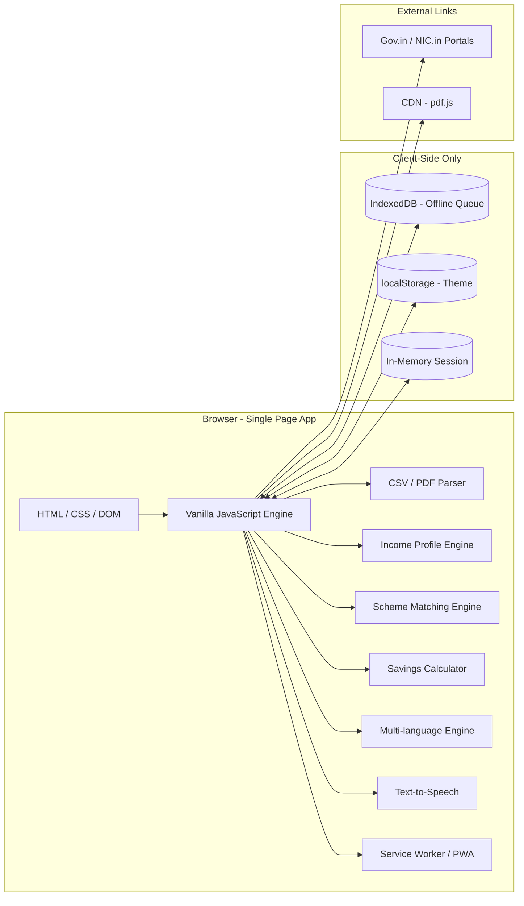

<div align="center">

# 💳 Kaam Card

**A privacy-first, browser-based platform that turns raw transaction data into welfare eligibility — in under 2 minutes.**

Built for India's 400M+ informal and gig workers, without ever asking for Aadhaar, PAN, or a server upload.

[](#technologies-used)
[](#features)
[](#privacy-and-safety)
[](#license)

[Demo Flow](#demo-flow) • [Features](#features) • [Architecture](#architecture-diagram) • [Run Locally](#run-locally) • [Privacy](#privacy-and-safety)

</div>

---

## 📖 Overview

Kaam Card transforms raw transaction data (CSV/PDF bank or UPI statements) into a **portable income profile**, matches workers against public welfare schemes using transparent eligibility rules, and suggests personalized micro-savings habits — all within 2 minutes, without storing any raw data or requiring Aadhaar/PAN.

The goal is to bridge the gap between India's informal workforce and the social security schemes they qualify for, by making their income story easy to understand, explain, and act on.

---

## 📑 Table of Contents

- [How It Works](#-how-it-works)
- [Features](#-features)
- [Process Flow Diagram](#-process-flow-diagram)
- [Architecture Diagram](#-architecture-diagram)
- [Technologies Used](#-technologies-used)
- [Demo Flow](#-demo-flow)
- [Run Locally](#-run-locally)
- [CSV Format](#-csv-format)
- [Privacy and Safety](#-privacy-and-safety)
- [Project Structure](#-project-structure)
- [Hackathon Definition of Done](#-hackathon-definition-of-done)

---

## 🔄 How It Works

1. **Secure Session** — The user enters their phone number and a demo OTP to start an isolated, in-memory sandbox session. No password or personal identity is stored.
2. **Data Upload** — The user uploads a bank statement CSV (or picks a sample dataset). The file is parsed entirely in the browser using a custom CSV parser that gracefully skips malformed rows.
3. **Income Profile Computation** — From the parsed credit/income transactions, the app computes:
   - Average daily income
   - Income variance (standard deviation)
   - Good-day threshold (mean + 0.5σ)
   - Bad-day threshold (mean − 0.5σ)
   - Good-day and bad-day counts
   - Monthly income estimate
4. **Scheme Matching** — The computed income profile, along with the user's age, occupation, and state, is matched against real welfare scheme criteria (PM-SYM, e-Shram, PM-JAY, PM-SVANidhi, etc.) using a deterministic scoring engine.
5. **Savings Suggestion** — An arithmetic-based micro-savings rule is generated: on high-earning days, set aside a calculated surplus to cover low-income days.
6. **Dashboard & Insights** — Results are presented in a mobile-first dashboard with an income chart, ranked scheme cards with plain-language reasons, savings projection, and a shareable summary.

---

## ✨ Features

### 📊 Income Analysis
- CSV/PDF bank statement parsing with malformed-row tolerance
- Sample datasets for delivery workers, street vendors, and messy data
- Average daily income, variance, good/bad day thresholds and counts
- Daily earnings trend chart
- Monthly income estimate
- Expense summary breakdown

### 🏛️ Scheme Matching
- Deterministic rule-based matching against real welfare schemes
- Schemes covered: PM-SYM, e-Shram, PM-JAY, PM-SVANidhi, PM-JJBY, PM-SBY, Delhi Construction Workers Welfare Board, and more
- Ranked results with eligibility/near-match classification
- Plain-language reasons for each match (age, income, occupation, state)
- Secure portal redirect with `.gov.in` / `.nic.in` domain validation
- Step-by-step application guidance modal with document checklist

### 💰 Smart Savings
- Personalized good-day surplus savings calculation
- Projected monthly and 3/6-month savings estimates
- Low-income day coverage projection

### 🔒 Privacy & Security
- 100% in-browser processing — no data sent to servers
- No Aadhaar, PAN, or bank account numbers collected
- Raw transaction rows discarded after aggregate computation
- In-memory session with phone-keyed isolation
- No `localStorage` for session data (only theme preference)
- Local Security Audit Trail logging all user actions
- Verified portal links validated against `.gov.in` / `.nic.in`

### 🎨 User Experience
- Mobile-first responsive design
- Light/dark theme toggle
- Multi-language support (English, Hindi, Tamil, Telugu, Marathi)
- Text-to-speech for scheme details (11 Indian languages)
- Interactive grid background with animated particles
- Custom cursor for desktop
- Service Worker for offline support
- PWA manifest for installable web app
- Shareable plain-text summary of worker profile

---

## 🗺️ Process Flow Diagram



---

## 🏗️ Architecture Diagram



---

## 🛠️ Technologies Used

### Core Stack

| Technology | Usage |
|---|---|
| **HTML5** | Application shell and semantic structure |
| **CSS3** | Responsive layout, theming (custom properties), animations |
| **Vanilla JavaScript (ES6+)** | All application logic — no framework dependencies |
| **IndexedDB** | Offline upload queue for demo reliability |
| **Service Workers** | Offline caching, PWA installability |
| **PDF.js** | Client-side PDF statement parsing |

### Google Services (Planned / Architecture Vision)

| Service | Purpose |
|---|---|
| **Google Cloud Translate API** | Real-time translation for additional Indian languages beyond the current 5 |
| **Google Maps Platform** | Worker location detection for state-specific scheme matching |
| **Firebase Authentication** | Production-grade phone OTP authentication replacing the demo flow |
| **Firebase Analytics** | Usage metrics to improve scheme matching coverage |
| **Google Cloud CDN** | Low-latency static asset delivery for PWA |

### NVIDIA Services (Planned / Architecture Vision)

| Service | Purpose |
|---|---|
| **NVIDIA RAPIDS** | GPU-accelerated income variance analysis and anomaly detection on large transaction datasets |
| **NVIDIA NeMo** | Natural language processing for extracting scheme eligibility criteria from unstructured government PDFs |
| **NVIDIA Triton Inference Server** | Production deployment of ML-based scheme recommendation models |
| **NVIDIA cuDF** | High-performance CSV/DataFrame processing for scaling to millions of transactions |

---

## 🎬 Demo Flow

1. Open the app — an intro video plays, then transitions to the landing page.
2. Tap **"LOG IN / START"**, enter a phone number and any 4-digit OTP.
3. Upload a CSV/PDF statement or choose a sample dataset.
4. Review parsed rows and any skipped malformed rows.
5. The dashboard loads with your income pattern, matched schemes, and savings rule.
6. Use the bottom navigation for **Dashboard**, **Upload**, **Insights**, and **Schemes**.
7. Tap any scheme card for step-by-step application guidance.
8. Copy the shareable summary from the **More** menu.

---

## 🚀 Run Locally

This is a static HTML/CSS/JavaScript app. No build step is required.

```bash
python3 -m http.server 8080
```

Then visit `http://localhost:8080`.

---

## 📄 CSV Format

Required columns:

```csv
date,amount,direction
2026-05-01,720,credit
2026-05-02,210,debit
```

| Field | Details |
|---|---|
| **Accepted date formats** | `YYYY-MM-DD`, `DD-MM-YYYY`, `DD/MM/YYYY` |
| **Accepted income directions** | `credit`, `income`, `in`, `deposit`, `received`, `cr` |

> Debit/expense rows are parsed but not counted as income.

---

## 🔐 Privacy and Safety

- No Aadhaar, PAN, or full bank account numbers are collected.
- Uploaded transactions are processed entirely in the browser.
- Raw transaction rows are discarded after aggregate income stats are computed.
- The demo session is in-memory and phone-keyed — no password login.
- No session token is stored in `localStorage` (only theme preference is persisted).
- External scheme links are hardcoded HTTPS URLs validated against `.gov.in` / `.nic.in` domains.
- Links found inside uploaded files are treated as inert text and never auto-followed.

---

## 📁 Project Structure

```text
.
├── index.html          # Entry point
├── styles.css          # All styles (3920+ lines)
├── app.js              # Application logic (6400+ lines)
├── api.js              # Simulated localStorage-backed API
├── db.js               # IndexedDB wrapper
├── csv-parsers.js      # CSV/PDF transaction parser
├── pdf-parser.js        # PDF.js integration
├── translate.js        # i18n engine (5 languages)
├── tests.js             # Automated test suite
├── sw.js                # Service Worker
├── manifest.json        # PWA manifest
├── schemes_db.json       # Welfare scheme database
├── land.mp4              # Intro video
├── favicon.svg / logo.svg / m.svg
├── COMPONENTS/UI/         # React reference components (design docs)
└── scripts/               # Scheme scraper utility
```

---

## ✅ Hackathon Definition of Done

A worker can go from sample/uploaded statement to:

- ✅ income pattern visualization
- ✅ matched schemes with plain-language reasons
- ✅ a concrete, personalized savings suggestion
- ✅ a shareable summary

**without** exposing sensitive identity numbers or persisting raw transaction data.

---

<div align="center">

Made with ❤️ for India's informal workforce

</div>